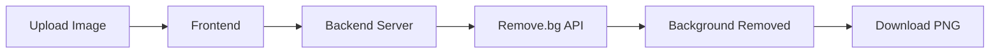

<div align="center">

# 🎨 RevBG
### AI-Powered Background Remover

Remove image backgrounds instantly with the power of AI.

[](https://revbg.netlify.app/)
[](https://revbg.netlify.app/)
[
](https://ai-background-remover-express.onrender.com)

---

### 🚀 Fast • 🎯 Accurate • 📱 Responsive • 🤖 AI-Powered

</div>

---

## 📖 About The Project

**RevBG** is a modern AI-powered web application designed to remove image backgrounds in seconds. Built with a clean and responsive interface, the platform allows users to upload images, process them using AI, and download high-quality transparent PNG files effortlessly.

The project demonstrates practical knowledge of **Frontend Development, Backend Development, API Integration, Deployment, and Secure Environment Variable Management**.

---

## ✨ Key Features

✅ AI-Powered Background Removal

✅ Drag & Drop Image Upload

✅ Instant Image Processing

✅ High-Quality PNG Download

✅ Mobile Responsive Design

✅ Modern User Interface

✅ Secure Backend API Integration

✅ Fast Processing Workflow

✅ Deployed Full-Stack Application

---

## 🖼️ Project Preview

<p align="center">
  
</p>

> Replace the screenshot above with your actual project screenshot.

---

## ⚡ Live Website

### 🌐 https://revbg.netlify.app/

---

## 🏗️ Tech Stack

### Frontend

<p>

</p>

- HTML5
- CSS3
- JavaScript

### Backend

<p>

</p>

- Node.js
- Express.js

### Deployment

<p>

</p>

- Netlify
- Render
- GitHub

### AI Service

- Remove.bg API

---

## 🔄 How It Works



---

## 📂 Folder Structure

```bash
RevBG
│
├── frontend
│   ├── index.html
│   ├── style.css
│   └── script.js
│
├── backend
│   ├── server.js
│   ├── package.json
│   └── .env
│
├── assets
│   └── images
│
└── README.md
```

---

## 🚀 Installation

### Clone Repository

```bash
git clone https://github.com/YOUR_USERNAME/revbg.git
```

### Navigate to Project

```bash
cd revbg
```

### Install Dependencies

```bash
npm install
```

### Create Environment Variables

```env
REMOVE_BG_API_KEY=YOUR_API_KEY
PORT=5000
```

### Run Server

```bash
npm start
```

---

## 🔒 Security Features

- Environment Variables
- Hidden API Keys
- Secure Backend Communication
- Protected API Requests
- No Client-Side Secret Exposure

---

## 📈 Future Enhancements

### 🎯 Planned Features

- Before & After Slider
- AI Background Replacement
- Multiple Download Formats
- Batch Processing
- Dark Mode
- Image Compression
- User Authentication
- Processing History
- Cloud Storage Integration

---

## 📚 Learning Outcomes

This project strengthened my understanding of:

- Full-Stack Development
- REST APIs
- Node.js & Express.js
- Frontend Development
- API Security
- Deployment Workflows
- Environment Variables
- Git & GitHub
- AI Service Integration

---

## 👨‍💻 Developer

<div align="center">

# Farhan Akthar

### B.Tech Computer Science & Engineering

Passionate about Web Development, AI Applications, and Building Real-World Software Solutions.

</div>

---

## 🌟 Why This Project?

RevBG was built to solve a common problem faced by content creators, designers, students, and professionals: removing image backgrounds quickly without requiring advanced editing skills.

The goal was to create a fast, reliable, and user-friendly solution while gaining hands-on experience with full-stack development and AI integration.

---

## 🤝 Contributing

Contributions are welcome.

If you'd like to improve RevBG:

```bash
Fork ➜ Create Branch ➜ Commit ➜ Push ➜ Pull Request
```

---

## ⭐ Support

If you found this project useful:

### ⭐ Star the Repository
### 🍴 Fork the Repository
### 📢 Share the Project

---

<div align="center">

## 🚀 Built with Passion by Farhan Akthar

### "Transforming Images with AI, One Click at a Time."

⭐ Don't forget to star the repository!

</div>
